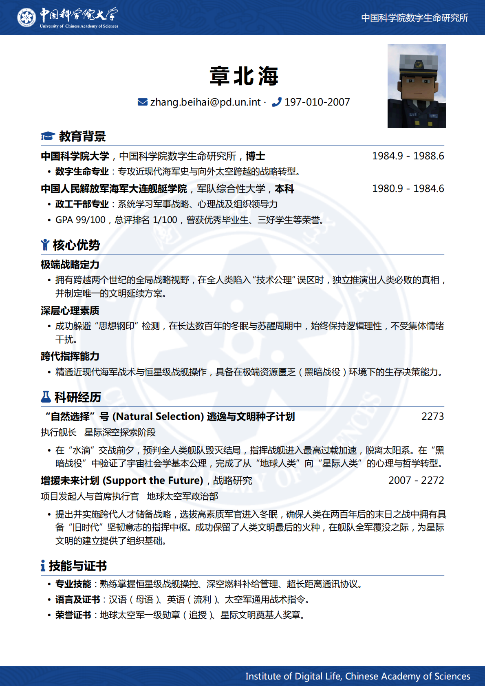

# UCAS-CV
国科大LaTeX简历模版，基于Overleaf上方渐鸿模版改编。
参考了NPU-CV简历模板中的部分代码。https://github.com/CSW33/NPU-CV/tree/main

推荐使用Overleaf，直接选择XeLaTeX即可（左上角Menu->Settings->Compiler）。

本地编译可能要使用三次XeLaTeX进行编译，否则无法正确显示照片。

章节的排序可以自行更改，也可以直接删除不要的部分。

LaTeX正文里出现下划线_，&，%等标点，需要在前加反斜杠转义。

# 页面预览

